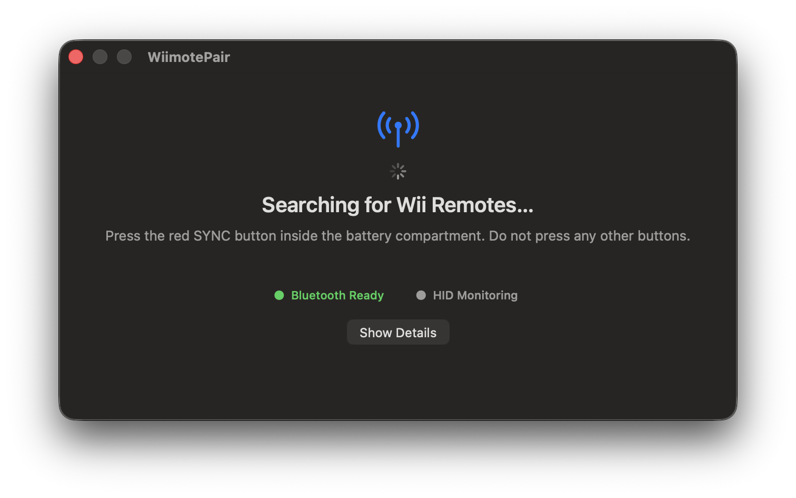
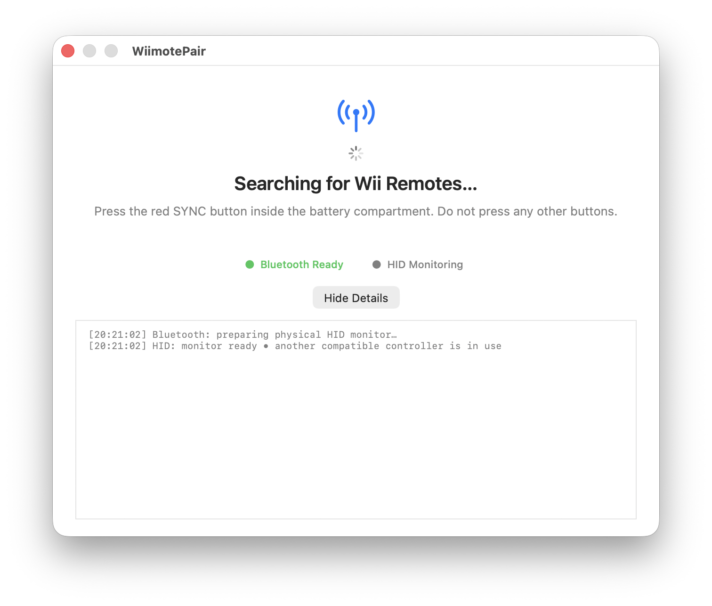

# WiimotePair for macOS

A native utility for pairing and maintaining a Wii Remote connection on macOS, including the **Wii Remote Plus with MotionPlus Inside (`Nintendo RVL-CNT-01-TR`)**.

This version fixes an issue where the remote completes pairing, flashes all four LEDs, and powers off a few seconds later. The app preserves the pairing session until macOS finishes creating the physical HID device, then initializes the remote through IOHID.

## Interface

WiimotePair follows the macOS appearance automatically and provides a compact pairing view plus an expandable diagnostic log.





## Requirements

- macOS 12.0 or later;
- a Mac with Bluetooth;
- Xcode with the macOS SDK to build from source;
- an original `RVL-CNT-01` or `RVL-CNT-01-TR` Wii Remote.

The `RVL-CNT-01-TR` is identified by:

- Vendor ID: `0x057e`;
- Product ID: `0x0330`.

The original Wii Remote uses Product ID `0x0306`.

## Required permissions

WiimotePair only needs permission to use **Bluetooth**.

On the first launch, macOS should display a Bluetooth access prompt. Choose **Allow**. You can review or change this permission later at:

```text
System Settings → Privacy & Security → Bluetooth → WiimotePair
```

Make sure the switch next to WiimotePair is enabled. If Bluetooth access was previously denied, quit the app completely with `Command-Q`, enable it in System Settings, and open the app again.


The downloadable build is signed ad hoc rather than notarized by Apple. If Gatekeeper blocks the first launch:

1. Control-click `WiimotePair.app` and choose **Open**.
2. Confirm **Open** in the dialog.
3. If that option is unavailable, open **System Settings → Privacy & Security**, locate the blocked-app message, and choose **Open Anyway**.

Only bypass Gatekeeper for a build obtained from this repository or produced locally with `Scripts/build.sh`.

## Supported Wii Remotes

WiimotePair supports both official Wii Remote revisions:

| Model | Bluetooth name | HID vendor/product ID
| --- | --- | --- | --- |
| Wii Remote | `Nintendo RVL-CNT-01` | `057e:0306`
| Wii Remote Plus | `Nintendo RVL-CNT-01-TR` | `057e:0330`

The procedure visible to the user is the same for both models. WiimotePair detects the Bluetooth name and then matches the correct physical HID product automatically.

## First-time synchronization

1. If the remote is already listed but does not work, remove it from **System Settings → Bluetooth**.
2. Open `WiimotePair.app`.
3. Remove the battery cover and briefly press only the red **SYNC** button.
4. Do not press any other buttons during pairing.
5. The four player LEDs should flash while the remote is discoverable.
6. Wait until the app displays:

   ```text
   Wii Remote Connected
   ```

Choose **Show Details** (or press `Command-D`) to inspect the underlying Bluetooth and HID messages, including the first received report.

### How synchronization works

The initial Bluetooth synchronization is equivalent for `RVL-CNT-01` and `RVL-CNT-01-TR`:

1. WiimotePair performs a Bluetooth Classic inquiry and recognizes a device whose name starts with `Nintendo RVL-CNT-01`.
2. The red SYNC button places the remote in discoverable pairing mode. Regular face buttons do not start first-time pairing.
3. Wii Remotes require a six-byte binary PIN derived from the Mac Bluetooth controller address in reverse byte order. WiimotePair submits this key through the macOS Bluetooth pairing service; it is not a text PIN that the user types.
4. After pairing, macOS establishes the Bluetooth HID connection and exposes the physical Nintendo device to IOHID.
5. WiimotePair selects product `0x0306` for the original Wii Remote or `0x0330` for the Wii Remote Plus. It ignores the synthetic game-controller device created by macOS.
6. The app opens the physical HID device, enables player-one LED, selects report mode `0x30`, and requests status. The connection is considered ready only after a real input report arrives.

The important difference is internal: the `RVL-CNT-01-TR` is more sensitive to the pairing session being stopped too early. WiimotePair keeps the completed pairing object alive while macOS creates the physical HID device, preventing the Remote Plus from flashing all four LEDs and powering off immediately after pairing. This behavior is harmless for the original `RVL-CNT-01` and lets both revisions use one workflow.

macOS may display the `RVL-CNT-01-TR` as a “Game Controller.” This is only its Bluetooth UI classification and does not prove that the physical HID session is ready.

## Reconnecting later

After either model has synchronized successfully, its Bluetooth link key is stored by macOS. Do not use the red SYNC button for normal reconnection:

1. Open WiimotePair or Dolphin.
2. Press `A` or another normal button once.
3. Wait for **Wii Remote Connected**.

The regular button wakes the remote and asks it to reconnect using the stored pairing. Use the red **SYNC** button only when pairing from scratch, after removing the controller from Bluetooth settings, or when moving it between a Wii and a Mac and the stored relationship needs to be replaced. If reconnection fails, quit and reopen the app or toggle Bluetooth off and on before retrying.

## Interface and shortcuts

The main window presents the connection as four clear stages: searching, connecting, connected, or connection issue. Technical messages remain available in the expandable diagnostics panel.

- `Command-D`: show or hide diagnostic details;
- `Command-R`: discard the current selection and search again;
- `Command-Q`: quit WiimotePair.

The Bluetooth and HID indicators use both text and color so their meaning remains accessible without relying on color alone.

## Diagnostic messages

- `ACL disconnected`: there is no basic Bluetooth connection; press a button on the remote.
- `ACL connected`: macOS sees the Bluetooth device, but the physical HID has not appeared yet.
- `physical device open`: the IOHID device was found and is being initialized.
- `waiting for first packet`: the initial commands were sent successfully.
- `connected and receiving`: a real input report confirmed that the connection works.
- `another compatible controller is in use`: another app has exclusive access to a compatible HID device. WiimotePair continues monitoring other matching devices.

## Architecture

The connection flow is:

```text
Bluetooth discovery
        ↓
Pairing with a binary PIN
        ↓
macOS HID service opens the L2CAP channels
        ↓
IOHIDManager finds the physical Nintendo device
        ↓
IOHIDDeviceOpen
        ↓
Reports 0x11, 0x12, and 0x15
        ↓
The first input report confirms the connection
```

The app does not open L2CAP channels `0x11` and `0x13` directly. Those channels are owned by the macOS HID service. Opening them simultaneously from the app causes contention with `bluetoothd`, timeouts, and disconnections.

The IOHID matching dictionaries also use `GCSyntheticDevice = false`, preventing the app from opening the synthetic gamepad created by GameController instead of the physical Wii Remote.

### Main components

- `IOBluetoothDeviceInquiry`: discovers nearby remotes;
- `IOBluetoothDevicePair`: performs pairing with the binary PIN derived from the Mac Bluetooth address;
- `IOHIDManager`: detects physical `057e:0306` and `057e:0330` devices;
- `IOHIDDeviceSetReport`: configures the player LED, report mode, and status request;
- input-report callback: confirms that the HID session is actually functional.

## Quick build

Run this command from the repository root:

```bash
./Scripts/build.sh
```

The script:

1. builds the Release configuration;
2. creates `dist/WiimotePair.app`;
3. applies an ad hoc signature with the Bluetooth entitlement;
4. verifies the signature;
5. creates `dist/WiimotePair.zip`.

Generated files are stored in `dist/` and are not tracked by Git.

## Building with Xcode

1. Open `WiimotePair.xcodeproj`.
2. Select the **WiimotePair** scheme and **My Mac** destination.
3. To use a development signature, select your team under **Signing & Capabilities**.
4. Choose **Product → Build**.

If no “Mac Development” certificate is installed, use `Scripts/build.sh` to create an ad hoc signed build for local testing.

## Permissions and security

The required user permission and Gatekeeper steps are described in [Required permissions](#required-permissions). The app carries this Bluetooth entitlement:

```text
com.apple.security.device.bluetooth
```

Pairing still depends on private `IOBluetooth` interfaces to send the binary PIN required by a Wii Remote. This version is therefore intended for testing and direct distribution, not for the Mac App Store.

## Troubleshooting

### The remote appears connected but is powered off

“Connected” in System Settings may represent only the ACL link. Check WiimotePair instead; the connection is considered functional only after `HID: connected and receiving` appears.

### All four LEDs flash and then turn off

Remove the remote from Bluetooth settings, open this version of WiimotePair, and pair it again using only the red SYNC button.

### Another compatible controller is in use

Quit other instances of WiimotePair, Dolphin, WiiController, or similar controller utilities. Then open only the app from `dist/WiimotePair.app`.

### The physical HID is found but cannot be opened

Quit other applications that may be using the remote, reopen WiimotePair, and reconnect. Also verify Bluetooth permission under **Privacy & Security**.

### Xcode cannot find a development certificate

Run `./Scripts/build.sh` to create an ad hoc build, or configure an Apple Developer account in Xcode.

## Origin and license

Based on [dolphin-emu/WiimotePair](https://github.com/dolphin-emu/WiimotePair). This project is licensed under GPL-2.0-or-later; see `LICENSES/GPL-2.0-or-later.txt`.
